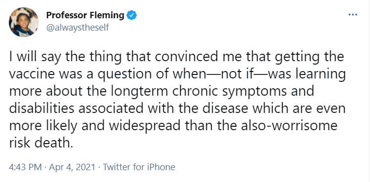
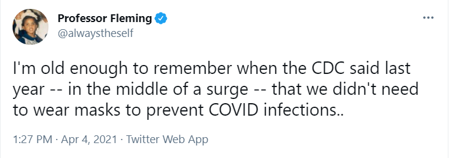

Now here's a take.

**I.**

This post was largely inspired by the [following tweet:](https://twitter.com/alwaystheself/status/1378597558860267520)

There is already litany of discourse on the bird site about this tweet, so I'm not sure it's neccesary to cover it all, but there's really an interesting implicit claim being made in the tweet here: *don't bother getting vaccinated*. To be clear, this is a fantastically stupid position, but it really does present a baffling stance that seem to be held by a small minority of liberals that *claim* to trust the science, but evidently do not upon closer inspection. Wasn't the whole point of quaratining so that we could flatten the curve and thereby reduce workload on the medical system and thus give scientists time to develop a vaccine? If not that, then what *was* the point?

If someone was, for some reason, on the fence about getting the vaccine, what do posts like this imply to that person? "Do your part for society, get vaccinated, then stay home just like you have for the past few months. The vaccine doesn't really work, we just need you to get it because that's what The Rules say."

I suspected that Professor Fleming does not actually believe the vaccine works, but then I saw this [next tweet](https://twitter.com/alwaystheself/status/1378855843194679297) which essentially confirmed that suspicion:

For someone who is apparently educated enough to be a professor, the idea that one would even *question* whether to get the vaccine or not is completely baffling. It really seems that Professor Fleming was completely willing to just catch COVID-19, attempt to not die, potentially give it to other people, and then carry on with their body's manufactured antibodies. But what *convinced* them to get the vaccine is the fact that, actually, COVID-19 is not a one-and-done kind of deal. It's not the chickenpox, where you just get it as a kid, then be done with it. No, there is some [non-trivial risk of long term effects](https://www.cdc.gov/coronavirus/2019-ncov/long-term-effects.html). 

Implicit in all of this is Fleming doesn't really believe in the vaccine. They weren't going to get it, until they made a calculated decision and decided that the [side effects of the vaccine](https://www.who.int/news-room/feature-stories/detail/side-effects-of-covid-19-vaccines) pale in comparision to the long-term side effects of COVID. I'll say it again: this position is ridiculous.

**II.**

I think what makes the discourse surrounding this tweet so fascinating is the broader question of *should we trust the CDC?*

I'm inclined to say *yes*, we should. What do they say you should do after you've been vaccinated?

The link is [here](https://www.cdc.gov/coronavirus/2019-ncov/vaccines/fully-vaccinated.html), but the main points are:

* *You can gather indoors with unvaccinated people of any age from one other household (for example, visiting with relatives who all live together) without masks or staying 6 feet apart, unless any of those people or anyone they live with has an increased risk for severe illness from COVID-19.*
* *If you travel in the United States, you do not need to get tested before or after travel or self-quarantine after travel.*

I.e., the vaccine is a license to go "buck wild" if by "buck wild" you mean "see friends and family". However, the link says to avoid medium-to-large public gatherings, so I think that means the frat party is off. Sorry, Kyle. Kappa Alpha Sigma will have to wait another day.

While the link doesn't say this explicitly, I'm willing to bet that *if* you're vaccinated, going to the gym (masked) is essentially safe. Restaurants are likely safe too. Make a judgement call with those activities, but the *science* says that normal life is on the horizon. After a year of lockdowns and death, this is pretty exciting stuff, really.

However, we forgot to ask the most important person in the room what they think of the CDC:

Astounding. 

Now I have to point to the sign again: [absence of evidence is not evidence of absence](https://en.wikipedia.org/wiki/Evidence_of_absence). This is a mistake that I see liberals continually make, which I find as fascinating as I do frustrating. What Fleming is saying here is "I don't trust the CDC", which is, honestly, not *that* terrible of an opinion to have. They *were* wrong about the masks, after all, but there is a distinction to be made here.

When the CDC did not recommend masks, they were making that claim from the following position: *we do not have the **statistical** evidence that masks do anything*. This does not mean that masks do nothing (we know that now), but rather that *no studies had been done, no evidence had been gathered*. But it does not take a p-value of $p \leq 0.05$ to know that masks should do something. Experts already knew that masks did something, just by analyzing the mechanics: Covid-19 spreads through aerosol droplets. Masks catch those droplets. In summary, mask up.

But since the CDC is a large *organization*, they cannot go on to make claims like this, because they CDC is not in the business of making [claims informed by prior knowledge](https://en.wikipedia.org/wiki/Prior_probability), but rather in making [evidence-backed claims](https://en.wikipedia.org/wiki/Evidence-based_medicine). I.e., if there is no *statistical* evidence of a claim, then the CDC *cannot assert that claim*. When COVID-19 was just hitting US shores, there were no studies on the disease, because it literally *had never been studied before*, and so there was no statistical evidence masks worked *because there were no studies yet*, and because the CDC can only assert positive statements, their position on masks was "uhh, we don't know that yet."

Fleming here is claiming that the CDC was *wrong*, and therefore untrustworthy when making the claim that vaccines make you mostly safe. But there *is* [statistical evidence](https://www.cdc.gov/media/releases/2021/p0329-COVID-19-Vaccines.html) that the vaccines work:

The problem here is that people like Fleming neither understand *nor* trust the science. 

**III.**

I don't know where I saw the tweet, but it said something like this: Vaccine horseshoe theory is when people who are fantatically pro- or anti-lockdown converge on the apparent belief that vaccines don't work. 

It made me laugh. It seems to be true. Why is this? I think the discourse here is that there are people out there who *like* the lockdowns, like being able to scold people for not doing their part, and want to feel like a glorified hall-monitor again. Ergo, they don't want the pandemic to end. There might be an element of truth to that, but seems extreme. There are definitely people out there who are enjoying the unprecidented levels of scolding they get to do, but as far as I know, they're all on that stupid bird site, so if you don't want to see them, you can just close your eyes and log off, man.

Either way, people that are supportive of Fleming's position like to claim that they actually *do* trust the science, and the science says that the vaccines offer no, or unknown protection against the COVID-19 variants that have been popping up. Funnily enough, if you ask them for why they believe this, they will cite the CDC:

I'll just say it: these people think that absence of evidence is evidence of absence. They think that *because* no large studies have confirmed the vaccine's efficacy against the variants, *therefore* the vaccine offers little to no protection. Nevermind the fact that most people got the vaccine, like, yesterday, or the fact that vaccines have essentially eradicated stuff like Polio and Smallpox. Do they think that those diseases did not have variants? I'm not a biologist, but I do know that Polio has variants and it turns out you can just take a vaccine for that. Is it so crazy to think that now that we have a vaccine, now that covid-19 is better understood, that we'll be able to continue developing booster shots for the new variants? 

I claim that it is not. I hate to sound like one of those *rationalists*, but my *priors* are indicating that as far as COVID-19 is concerned, we will be okay.

**IV.**

Some people, I guess, are dubious because of articles like this:

I'm not showing who retweeted this. After all, I don't know them and don't care who they are. They have, like, 20 followers. But they retweeted this article as evidence that one should still be in lockdown-mode after getting vaccinated. I.e., they used this article to implicitly support the claim that vaccines don't work. Let's take a look.

2.2 million people in Illinois have received a full vaccination. 399 Tested positive for coronavirus (largely asymptomatic), 17 were hospitalized, 6 died. Does this mean we need to stay in lockdown mode? Let's just use this article's numbers and compute some probabilities.

Roughly, $P[\text{covid} | \text{vaccine}] = 0.0002$. Also, $P[\text{hospital} | \text{covid} \cap \text{vaccine}] = 0.0425$, and $P[\text{die of covid} | \text{covid} \cap \text{vaccine} \cap \text{hospital}] = 0.35$.

The last number seems scary. 35% chance to die if hospitalized from Covid after vaccination? But, that's not actually what we care about. This is: $P[\text{die of covid} | \text{vaccine}]$.  

Using the law of total probability, the computation is

$$\begin{align*}
P[\text{die}| \text{vaccine}] & = P[\text{die} \cap (\text{hospital} \cap \text{covid}) | \text{vaccine}]\\
& + P[\text{die} \cap (\neg\text{hospital} \cap \text{covid}) | \text{vaccine}]\\
& + P[\text{die} \cap (\text{hospital} \cap \neg \text{covid}) | \text{vaccine}]\\
& + P[\text{die} \cap (\neg \text{hospital} \cap \neg \text{covid}) | \text{vaccine}]
\end{align*}$$

Now, since we are computing whether someone dies from covid or not, all cases where the person dies of covid, while not having covid, is going to have zero probability. So, 

$$
\begin{align*}
P[\text{die}| \text{vaccine}] & = P[\text{die} \cap (\text{hospital} \cap \text{covid}) | \text{vaccine}]\\
& + P[\text{die} \cap (\neg\text{hospital} \cap \text{covid}) | \text{vaccine}]
\end{align*}
$$

Now, make the assumption that anyone who dies of covid is first hospitalized. Then the second summand disappears. Thus,

$$
\begin{align*}
P[\text{die}| \text{vaccine}] & = P[\text{die} \cap (\text{hospital} \cap \text{covid}) | \text{vaccine}] \\
& = P[\text{die} | \text{hospital} \cap \text{covid} \cap \text{vaccine}]\\
& \times P[\text{hospital} | \text{covid} \cap \text{vaccine}] \\
& \times P[\text{covid} | \text{vaccine}] \\
& = (0.0002)(0.0425)(0.35) \\
& \approx \frac{3}{1000000}.
\end{align*}$$

In other words, 3 in a 1,000,000 chance of dying from COVID once you're vaccinated, from a back-of-the-envelope calculation. I don't have the numbers in front of me, but this is probabl much safer than dying in a car crash. (Anyone want to bet?)

 Even if you multiply a fudge-factor of 10, those odds are still *really* good. The 95% efficacy of the Moderna and Phizer vaccines *don't* mean that you have a 5% chance of getting the virus, but that you have a 95% *lower* chance of getting the virus. So, if your probability of getting the virus was roughly 10% (30 million USA covid cases, population of 330 million or so), then your *vaccinated* chance of getting the virus is now 0.5%. Your chance of getting the virus is **20 times lower**. This is really good. 

The take away is that *even if* the vaccine is not as effective against the variants ([and the data suggests that it still provides some levels of protection](https://www.nejm.org/doi/full/10.1056/NEJMc2100362)), the vaccines work.

Whether you stay at home or go "buck wild" post-vaccine is up to you, but the evidence does suggest a light at the end of the tunnel. In other words, Fleming and people like Fleming: shut up. You're apparently a professor, so people will see you as an authority (even though you're not), and you're undermining the vaccination effort.
